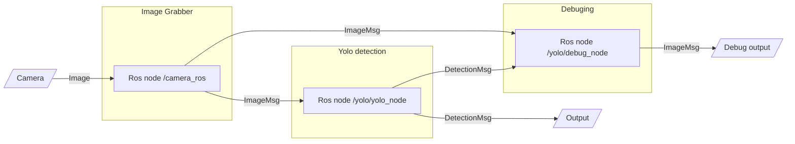

# Delogy computer vision
This project realize fire detector detection in image using YOLO model. This repository contains the development code for training the models and the source code of the ROS2 nodes for building the detection pipeline.

## Instalation
To build the entire pipeline, you need to install the ROS2 distribution (tested ```rolling```), create a ROS2 workspace, create a python virtual environment with requirements, and set up a build of ros nodes running with the created environment.

Pipelines can be split and run in different docker containers.

## ROS2 node structure
The simplified ROS2 procedure is as follows:


At the beginning is the camera (HW), from which the first ROS node (camera_ros) takes images. It sends the images in a standard message to the second ROS node (yolo_node), which performs the detection and generates a specific fire sensor detection message.

YOLO detection is defined as follows:
```
# defines a YOLO detection result

# class probability
int32 class_id
string class_name
float64 score

# ID for tracking
string id

# 2D bounding box surrounding the object in pixels
yolo_msgs/BoundingBox2D bbox

# 3D bounding box surrounding the object in meters
yolo_msgs/BoundingBox3D bbox3d

# segmentation mask of the detected object
# it is only the boundary of the segmented object
yolo_msgs/Mask mask

# keypoints for human pose estimation
yolo_msgs/KeyPoint2DArray keypoints

# keypoints for human pose estimation
yolo_msgs/KeyPoint3DArray keypoints3d
```
With BoundingBox2D:
```
# 2D position and orientation of the bounding box center
yolo_msgs/Pose2D center

# total size of the bounding box, in pixels, surrounding the object's center
yolo_msgs/Vector2 size
```

For debugging purposes, a third ROS node (debug_node) can be added that receives images and detections and draws the detection into the image.

## Training detection models
The development directory contains the scripts needed to train and test the detection models. For the YOLO model, there is the YOLOTrain directory. Training is done using the [ultralytics](https://github.com/ultralytics/ultralytics) framework.

## Repository tree
```bash
.
├── Development             ... detection model training scripts
│   ├── Classificication
│   ├── DataPrep
│   ├── SSDTrain
│   │   └── pytorch-vision-main-references-detection
│   └── YOLOTrain
└── RosNodes                ... source code for the ROS2 nodes
    ├── camera_ros
    │   ├── launch
    │   └── src
    └── yolo_ros
        ├── docs
        ├── yolo_bringup
        │   └── launch
        ├── yolo_msgs
        │   ├── msg
        │   └── srv
        └── yolo_ros
            ├── resource
            ├── test
            └── yolo_ros
```